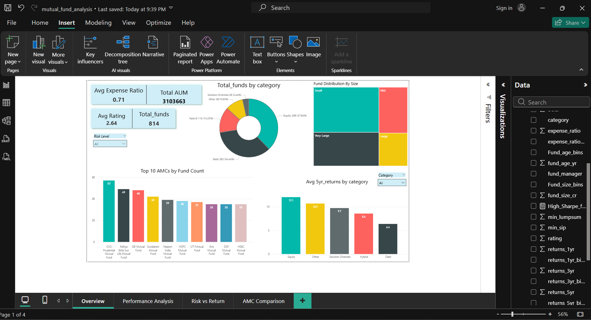
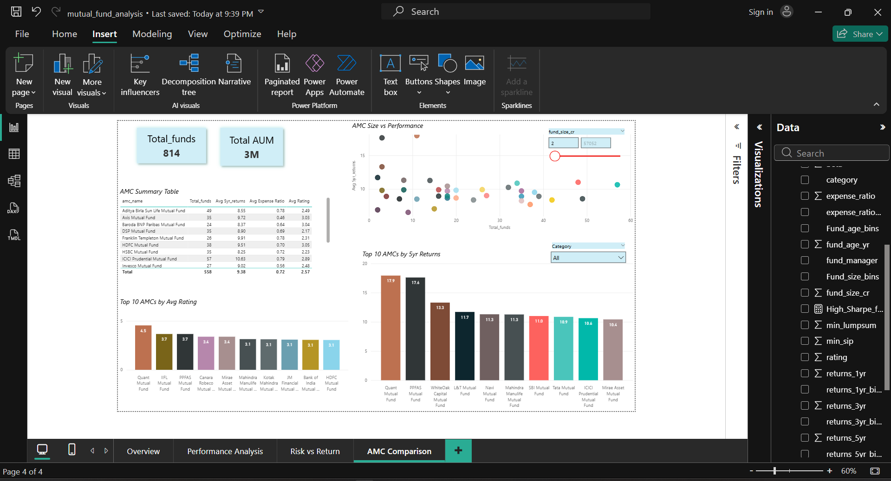

# Mutual Fund Performance Analysis

## Overview
Analyzed 814 Indian mutual fund schemes to identify performance patterns,
risk-return tradeoffs, expense ratio impact and AMC-wise comparisons
using MySQL and Power BI.

## Tools Used
- MySQL - Data exploration and analysis
- Power BI - Interactive dashboard
- Power Query - Data cleaning and transformation
- DAX - Custom measures and KPIs

## Dataset
- Source: Kaggle - Mutual Funds India Detailed
- File: comprehensive_mutual_funds_data.xlsx
- Records: 814 mutual fund schemes
- Columns: 20 attributes including returns, risk metrics, AMC details

## Project Structure
mutual-fund-performance-analysis/
│
├── data/
│   └── comprehensive_mutual_funds_data.xlsx
│
├── sql/
│   └── analysis_queries.sql
│
├── dashboard/
│   └── mutual_fund_analysis.pbix
│
├── screenshots/
│   ├── overview.png
│   ├── performance_analysis.png
│   ├── risk_vs_return.png
│   └── amc_comparison.png
│
└── README.md

## Dashboard Pages
1. **Overview** - Fund universe snapshot, AUM distribution, category breakdown
2. **Performance Analysis** - Top funds, category returns, fund age vs returns
3. **Risk vs Return** - Sharpe ratio analysis, expense ratio impact, risk levels
4. **AMC Comparison** - Best performing fund houses by returns and rating

## Key Findings
- Equity funds deliver highest avg 5yr returns at 12.1% vs Debt at 6.4%
- 546 funds have Sharpe ratio above 1 - indicating good risk adjusted returns
- Low expense ratio funds outperform high cost funds across all categories
- Quant Mutual Fund leads AMC rankings by both avg 5yr returns and rating
- Total AUM across all 814 funds = ₹31,03,663 crore

## SQL Queries
Key analyses performed using MySQL:
- Category wise average returns comparison (1yr, 3yr, 5yr)
- Top 10 and bottom 10 funds by 5yr returns
- Expense ratio impact on returns using CASE bucketing
- AMC wise performance comparison
- Window functions - RANK() and AVG() OVER PARTITION BY

## Screenshots

### Overview

### Performance Analysis

### Risk vs Return

### AMC Comparison

## Author
**Ankur Kumar Singh**
Fresher Data Analyst | SQL • Power BI • DAX • Excel
[LinkedIn](https://linkedin.com/in/ankur-singh-82010a1b8) | 
[GitHub](https://github.com/ankur-analytics)
